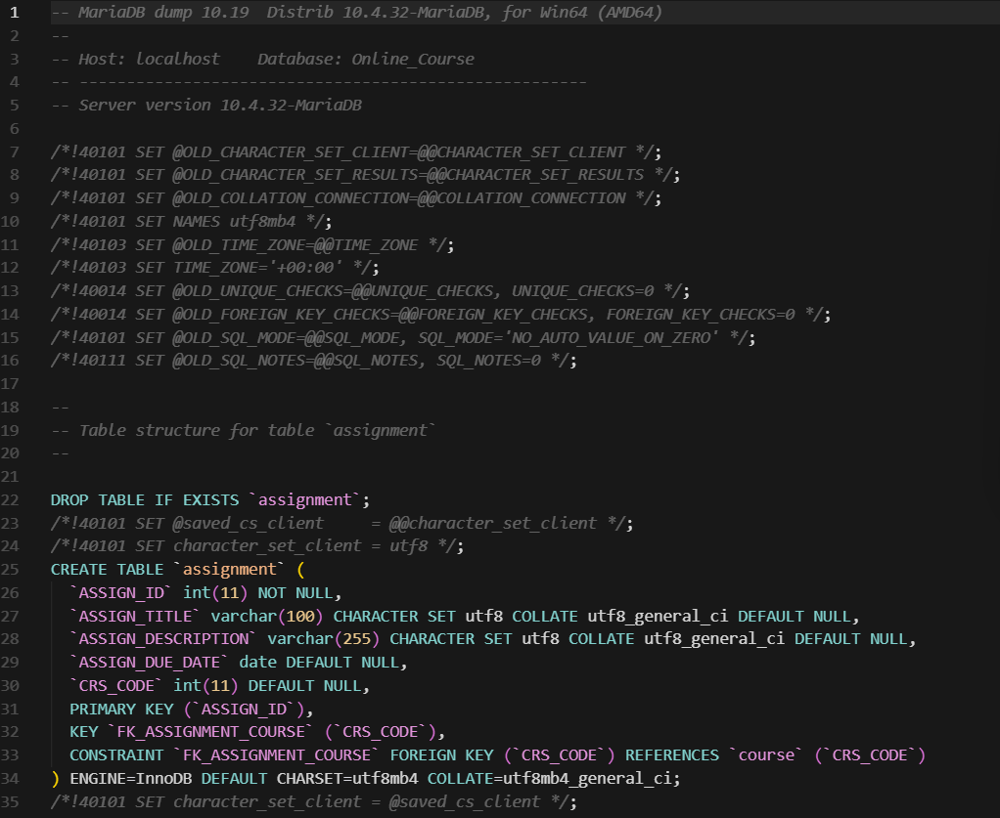

# 🎓 Online Course Enrollment System

### 📘 Course Project: TDB6113-DATABASE SYSTEMS

[](https://mysql.com/)
[]()

## 📖 Project Overview
The **Online Course Enrollment System** is a comprehensive database design project. It models the complex relationships required for a university or online platform to manage students, instructors, courses, and enrollments. The project focuses on rigorous Entity-Relationship mapping, normalization, and advanced SQL querying.

## 📊 Key Features
*   **Robust Schema Design:** Fully normalized database schemas to eliminate redundancy.
*   **Entity-Relationship Modeling:** Detailed ERDs mapping multi-modal relationships between Students and Courses.
*   **Complex SQL Queries:** Advanced query operations using Joins, Subqueries, and Aggregate functions.
*   **Transaction Management:** Ensuring data integrity for concurrent enrollments.

## 💾 Tech Stack
*   **Database Language:** SQL (Structured Query Language)
*   **RDBMS:** MySQL / Oracle
*   **Design Tools:** Relational Algebra, ERD Mapping tools

## 🖨️ Screenshots


*Figure 1: Entity-Relationship Diagram (ERD) detailing the core architectural schema.*

## 🗂️ Project Structure
```text
Database/
├── sql/            # SQL scripts for table creation and sample data
├── docs/           # Documentation, ERDs, and relational algebra design
└── assets/         # Diagrams and screenshots
```

## ⚙️ Installation & Setup
1. Clone this repository.
2. Ensure you have an SQL Server running (e.g., MySQL, XAMPP, or Oracle).
3. Open your preferred SQL client (e.g., DBeaver, MySQL Workbench).
4. Run the schema creation scripts located in `/sql`.

## ▶️ How to Run
1. Execute the `create_tables.sql` script to initialize the database.
2. Execute the `seed_data.sql` script to populate the database with theoretical students and courses.
3. Test the sample queries provided to observe insights like class capacities and enrollment stats.
